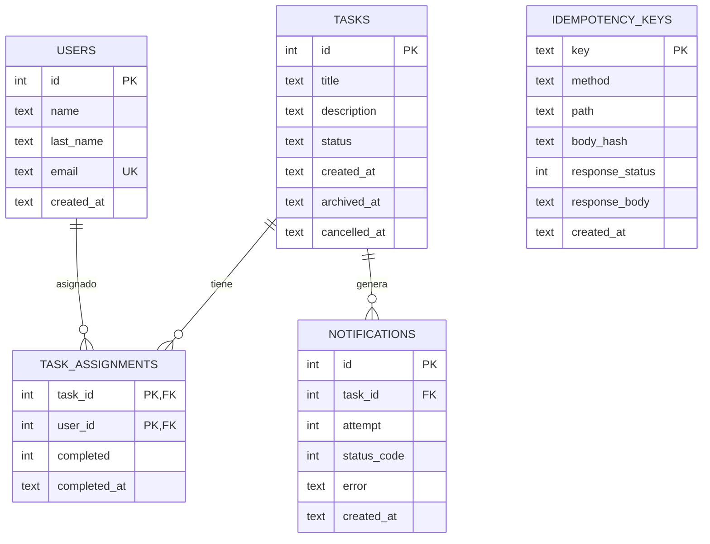

# Reto Geest – API REST de gestión de tareas

API REST desarrollada para el reto técnico de Geest. El proyecto permite crear usuarios y tareas, asignar tareas a varios usuarios y controlar su avance hasta que todos hayan terminado.

Además del CRUD básico, se agregaron mecanismos para manejar algunos problemas que aparecen en aplicaciones reales: requests duplicadas, operaciones concurrentes, reintentos de notificaciones y cancelación de tareas.

## Stack

El proyecto está construido con:

- **Node.js 20+**
- **TypeScript**
- **Express**
- **SQLite**
- **better-sqlite3**
- **Zod**
- **Vitest**
- **Supertest**

### ¿Por qué estas tecnologías?

Elegí Express porque para una API pequeña permite mantener una estructura sencilla y fácil de probar.

Para la base de datos utilicé SQLite con `better-sqlite3`. Para este reto resulta práctico porque tenemos una base SQL real, soporta transacciones y no necesitamos levantar un servidor de base de datos adicional.

TypeScript ayuda a mantener el código más seguro y facilita detectar errores antes de llegar a ejecución.

Zod se utiliza para validar los datos recibidos por los endpoints.

Finalmente, Vitest y Supertest permiten probar los endpoints de forma bastante cercana a como serían utilizados en producción.

---

# Funcionalidades principales

La API permite:

- Crear y consultar usuarios.
- Crear tareas.
- Asignar una tarea a uno o varios usuarios.
- Marcar una asignación como completada.
- Archivar automáticamente una tarea cuando todos los usuarios terminan.
- Cancelar tareas mediante borrado lógico.
- Consultar tareas abiertas, archivadas o canceladas.
- Consultar el detalle de una tarea y sus asignaciones.
- Registrar los intentos de notificación.
- Evitar operaciones duplicadas mediante idempotencia.

---

# Endpoints

| Método | Ruta                                      | Descripción                                        |
| ------ | ----------------------------------------- | -------------------------------------------------- |
| POST   | `/users`                                  | Crear un usuario                                   |
| GET    | `/users`                                  | Listar usuarios y sus tareas pendientes            |
| GET    | `/users/:idUser/tasks`                    | Consultar las tareas de un usuario                 |
| POST   | `/tasks`                                  | Crear una tarea                                    |
| POST   | `/tasks/:idTask/assign`                   | Asignar usuarios a una tarea                       |
| POST   | `/tasks/:idTask/complete`                 | Marcar la asignación de un usuario como completada |
| GET    | `/tasks?status=open\|archived\|cancelled` | Listar tareas por estado                           |
| GET    | `/tasks/:idTask`                          | Consultar el detalle de una tarea                  |
| DELETE | `/tasks/:idTask`                          | Cancelar una tarea mediante borrado lógico         |
| GET    | `/tasks/:idTask/notifications`            | Consultar los intentos de notificación             |

Los errores siguen un formato común:

```json
{
  "error": {
    "code": "ERROR_CODE",
    "message": "Descripción del error"
  }
}
```

---

# Estados de una tarea

Una tarea puede tener uno de estos estados:

```text
open
  │
  ├──> archived
  │
  └──> cancelled
```

### `open`

La tarea está activa y puede recibir asignaciones y actualizaciones.

### `archived`

La tarea pasa a este estado cuando todos los usuarios asignados han completado su parte.

### `cancelled`

La tarea puede cancelarse mediante:

```http
DELETE /tasks/:idTask
```

No se elimina físicamente de la base de datos. Esto permite conservar las asignaciones y las notificaciones para mantener el historial.

---

# Idempotencia

Los endpoints `POST` permiten utilizar un header `Idempotency-Key`.

Ejemplo:

```http
Idempotency-Key: create-task-001
```

Esto sirve para evitar que una misma operación se ejecute varias veces cuando, por ejemplo, el cliente reintenta una petición debido a un timeout.

El middleware de idempotencia funciona de la siguiente forma:

1. Obtiene la `Idempotency-Key`.
2. Genera un hash del body.
3. Busca si ya existe una petición con esa misma key.
4. Si la key existe y el body es el mismo, devuelve la respuesta almacenada.
5. Si la key existe pero el body es diferente, devuelve `409 IDEMPOTENCY_CONFLICT`.
6. Si la key no existe, la operación continúa y la respuesta exitosa se guarda.

También se tiene en cuenta el caso de dos requests concurrentes utilizando la misma key. Para eso se utiliza un `Map` de promesas en memoria junto con un `INSERT` atómico en SQLite.

La información persistida permite que la idempotencia sobreviva a un reinicio del proceso.

### Decisión

La idempotencia es opcional. Si un `POST` no incluye `Idempotency-Key`, se procesa normalmente.

Además, sólo se almacenan respuestas exitosas. Si una operación falla, el cliente puede volver a intentarla utilizando la misma key.

---

# Archivado y concurrencia

Una de las partes más importantes del reto es evitar que dos requests concurrentes archiven la misma tarea o generen varias notificaciones.

Cuando un usuario completa su asignación, la operación se ejecuta dentro de una transacción SQLite.

El proceso es:

1. Se marca la asignación del usuario como completada.
2. Se revisa si todavía quedan usuarios pendientes.
3. Si no quedan pendientes, se intenta cambiar la tarea de `open` a `archived`.
4. El `UPDATE` sólo se ejecuta si la tarea sigue en estado `open`.
5. Se revisa el número de filas modificadas mediante `changes`.

Por ejemplo:

```sql
UPDATE tasks
SET status = 'archived',
    archived_at = CURRENT_TIMESTAMP
WHERE id = ?
  AND status = 'open';
```

Si `changes === 1`, esa request fue la que realizó el archivado y, por lo tanto, es la única que debe generar la notificación.

Si otra request llega al mismo tiempo, encontrará que la tarea ya no está en estado `open`, por lo que no volverá a archivar ni a notificar.

Esto evita duplicados cuando dos usuarios completan una tarea prácticamente al mismo tiempo.

---

# Notificaciones

Cuando una tarea pasa de `open` a `archived`, la API puede enviar una notificación HTTP a la URL definida en `NOTIFY_URL`.

Los errores se manejan de la siguiente manera:

- Errores de red → se reintenta.
- Respuestas `5xx` → se reintenta.
- Respuestas `4xx` → no se reintenta.

Los reintentos utilizan backoff exponencial:

```text
Intento 1 → inmediatamente
Intento 2 → después del backoff
Intento 3 → después del siguiente backoff
```

El número máximo de intentos es 3.

Cada intento queda registrado en la tabla `notifications`, incluyendo:

- número de intento
- código HTTP
- error, cuando existe
- fecha y hora

Esto permite revisar posteriormente qué ocurrió con una notificación.

Si `NOTIFY_URL` está vacío, no se realiza ninguna llamada externa.

> En una aplicación real probablemente movería esta parte a una cola como BullMQ, SQS u otra solución similar para que los reintentos no dependan del proceso HTTP principal.

---

# Cancelación de tareas

Como mejora adicional se implementó el borrado lógico de tareas.

En lugar de eliminar una tarea físicamente,:

```http
DELETE /tasks/:idTask
```

la cambia a:

```text
status = cancelled
```

y registra:

```text
cancelled_at
```

Esto permite conservar el historial de la tarea, sus asignaciones y las notificaciones generadas anteriormente.

La decisión se tomó porque cancelar una tarea es una operación bastante común en sistemas reales y evita perder información histórica.

---

# Base de datos

La estructura principal es:



Las migraciones se encuentran en:

```text
db/migrations/
```

y se ejecutan de forma idempotente al iniciar la aplicación.

---

# Reglas principales

Estas son algunas de las decisiones tomadas para evitar comportamientos ambiguos:

- Una tarea sólo puede estar en `open`, `archived` o `cancelled`.
- Un usuario no puede aparecer dos veces en la misma tarea.
- Volver a asignar el mismo usuario es un no-op exitoso.
- No se pueden asignar usuarios a una tarea archivada o cancelada.
- Una asignación ya completada no se vuelve a procesar.
- Una tarea sólo se archiva cuando todas sus asignaciones están completadas.
- El email de cada usuario es único.
- Las respuestas exitosas pueden almacenarse para idempotencia.
- No existe autenticación porque está fuera del alcance del reto.

---

# Instalación

Requisitos:

- Node.js 20 o superior
- pnpm 9 o superior

Instalar dependencias:

```bash
pnpm install
```

Crear el archivo de configuración:

```bash
cp .env.example .env
```

Ejecutar migraciones:

```bash
pnpm migrate
```

Iniciar el servidor:

```bash
pnpm dev
```

La API estará disponible en:

```text
http://localhost:3000
```

---

# Variables de entorno

| Variable               | Descripción                           | Valor por defecto |
| ---------------------- | ------------------------------------- | ----------------- |
| `PORT`                 | Puerto de la API                      | `3000`            |
| `DB_FILE`              | Archivo de SQLite                     | `./data.sqlite`   |
| `NOTIFY_URL`           | URL utilizada para las notificaciones | vacío             |
| `NOTIFY_RETRY_BASE_MS` | Base del backoff de reintentos        | `1000`            |

---

# Tests

Para ejecutar la suite:

```bash
pnpm test
```

Los tests cubren principalmente:

- creación de usuarios
- creación de tareas
- asignaciones
- completado de tareas
- archivado
- cancelación
- idempotencia
- concurrencia
- notificaciones y reintentos

La intención no fue solamente comprobar que los endpoints devuelvan `200`, sino probar algunos escenarios que pueden provocar datos duplicados o inconsistentes.

---

# Decisiones y trade-offs

Este proyecto está pensado como un reto técnico, por lo que algunas decisiones buscan mantener el código simple sin dejar de cubrir problemas reales.

### SQLite

Para este proyecto es suficiente y simplifica mucho el despliegue.

En una aplicación con múltiples instancias de la API probablemente utilizaría PostgreSQL u otra base de datos orientada a ese escenario.

### Notificaciones dentro del proceso

Los reintentos actualmente ocurren dentro del mismo proceso mediante `setTimeout`.

Es suficiente para el reto, pero en producción movería el trabajo a una cola para evitar que una notificación lenta afecte al proceso HTTP.

---

# Objetivo del proyecto

Más allá de implementar los endpoints solicitados, el objetivo fue construir una API pequeña pero con algunas características que normalmente aparecen cuando un sistema empieza a utilizarse de verdad:

- requests repetidas
- concurrencia
- persistencia
- recuperación ante errores
- trazabilidad
- operaciones que necesitan ser atómicas

El resultado es una API relativamente sencilla de entender, pero con una base que permite evolucionarla hacia un sistema más robusto.
